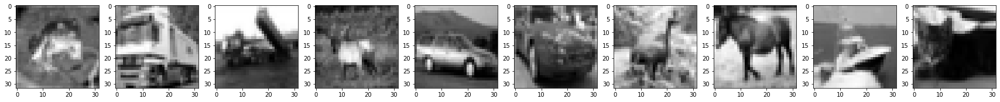
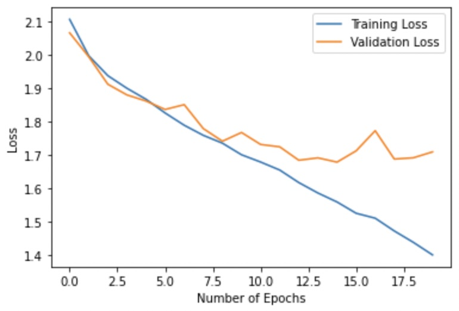
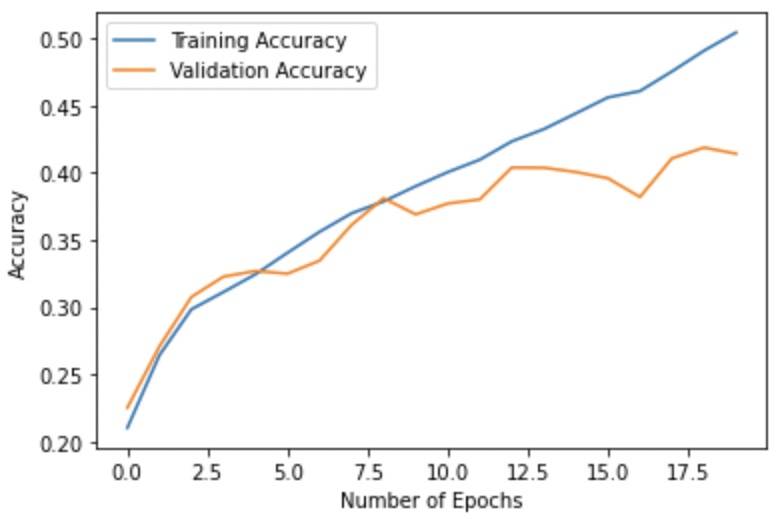
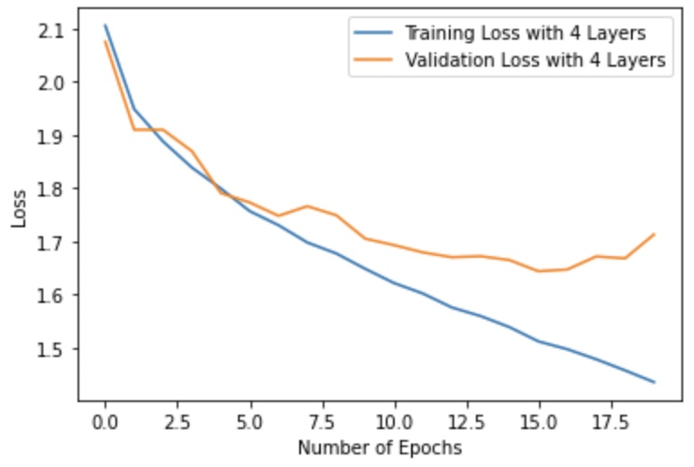
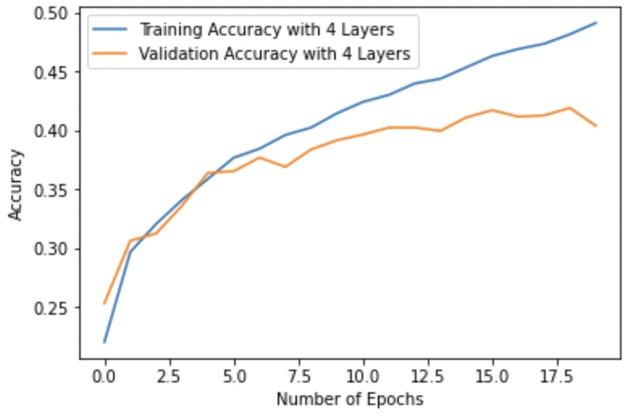

In this project, we will try to perform an Image Classification task using an _Artificial Neural Network_. We will try to investigate phenomena such as _underfitting_ and _overfitting_, and will come up with some solutions to these problems. The aim of this project isn't necessarily to obtain the highest accuracy, but make sure the model maintains similar levels of performances with both training and unseen data. We use Tensorflow in this project.

You can continue with this post or jump right to the notebook right [here](https://github.com/oppongk23/Image-Classification-ANN/blob/main/ANN_Assignment.ipynb). 

#### The Dataset
The [CIFAR-10 dataset](https://www.cs.toronto.edu/~kriz/cifar.html) is used in this project.The dataset is a collection of about 60,000 small images. Each image is an RGB image with a size of 32x32. The dataset is also divided into two sets: a training set and a test set. The training data comprises 50,000 images divided into batches of 10,000 images and the test set comprises 10,000 images. There are 10 different classes in the dataset and each training batch contains 1,000 images from each class.

In the course of the project the data is normalized and converted to grayscale to aid a faster training process and to reduce the computational load.


#### Importing the Dependencies
We begin by importing the tensorflow and keras libraries along with some other modules in those libraries.

```
import tensorflow as tf
from tensorflow import keras
import numpy as np
import matplotlib.pyplot as plt
from keras.datasets import cifar10
from keras import regularizers
from tensorflow.keras.models import Sequential
from tensorflow.keras.layers import Conv2D, Dense, MaxPool2D, Flatten, Dropout
```


#### Dataset Preparation
We then download the dataset and normalize it, then change it to grayscale. By doing this, we take away the 3 RGB channels and replace it with only one channel.

```
# Downloading the cifar10 dataset 
(x_train, y_train), (x_test, y_test) = cifar10.load_data()

# Changing the data type of training and testing data and normalizing them
x_train = x_train.astype("float32")/255.0
x_test = x_test.astype("float32")/255.0


# Changing the images to grayscale
def grayscale(data, dtype='float32'):
  # luma coding weighted average in video systems
  r, g, b = np.asarray(.3, dtype=dtype), np.asarray(.59, dtype=dtype), np.asarray(.11, dtype=dtype)
  rst = r * data[:, :, :, 0] + g * data[:, :, :, 1] + b * data[:, :, :, 2]
  # add channel dimension
  rst = np.expand_dims(rst, axis=3)
  return rst

X_train_gray = grayscale(x_train)
X_test_gray = grayscale(x_test)

```

After plotting, we have the image below
```
# Plotting the first 10 images again to ensure the mages are in grayscale
display_images = X_train_gray.reshape(-1, 32,32)
fig, axes = plt.subplots(1, 10, figsize = (30, 10))
for img, ax in zip(display_images[:10], axes):
  ax.imshow(img, cmap=plt.get_cmap('gray'))
plt.show()
```



#### Building the first model
We can then construct an ANN with an input layer, 8 hidden layers and an output layer. Each of the 8 hidden layers will have 512 units (perceptrons) with the ReLU activation funciton. ReLU is a non-linear function that takes the maximum argument between a value passed to it and 0. 
The final layer will use a softmax function to output a series of probabilities relative to each class. The class with the highest probability is chosen as the class of the input image.

The training and validation sets will be split in an 80:20 ratio.

Then we can go ahead and train our model

```
# Creating the model with 8 hidden layers aside the input and output layers
model = keras.Sequential([keras.layers.Flatten(input_shape = (32, 32)), 
                          keras.layers.Dense(512, activation="relu"),
                          keras.layers.Dense(512, activation="relu"),
                          keras.layers.Dense(512, activation="relu"), 
                          keras.layers.Dense(512, activation="relu"),
                          keras.layers.Dense(512, activation="relu"),
                          keras.layers.Dense(512, activation="relu"),
                          keras.layers.Dense(512, activation="relu"),
                          keras.layers.Dense(512, activation="relu"),
                          keras.layers.Dense(10, activation= "softmax")])
                          
# Compiling the model with the adam optimizer, cross entropy loss, and accuracy as the metric
model.compile(optimizer="adam", loss = "sparse_categorical_crossentropy", metrics=["accuracy"])

# Training the model
training_summary = model.fit(X_train_gray, y_train, epochs=20, batch_size=128, validation_split=0.2)
```


#### Analysing the results
We plot the training and validation losses and accuracies, to see how the model performs on both seen and unseen data.
Below is the plot of the training and validation losses.




Also, we can take a look at the training and validation accuracies.
 


We can note a few things from both plots. From the first plot, it is apparent that the training loss kept reducing with each epoch. At the first epoch, the training loss was around 2.1 and the validation loss was around 2.0. After the 7th epoch, the training loss kept reducing but the validation loss went up till it descended to a plateau after the 10th epoch. At the 20th epoch, the validation loss was about 1.71 and the training loss was 1.39. 

From the second plot, the training accuracy is on a fairly straightforward trajectory. It increases from around 21% and it is around *50.35%* by the 20th epoch. The validation accuracy on the other hand starts to increase steadily till it plateaus at about *40.85%* which indicates a difference of about 10% between both accuracies. 

The huge difference between the accuracies and the loss values show that the model does not generalize very well and that translates to a typical case of an **_overfitted_** model.

When the model is ran on the test set, the accuracy is around *40.96%*. 


#### Improving the model performance
Overfitting usually means that the model in question has learnt higher level peculiarities about the training data that aren't exactly necessary. One way of dealing with overfitting is to **_reducing the complexity_** of the model. This way you reduce the _capacity_ of the model and hence, its ability to learn all the overly complex features from the training data.

We can construct a simpler model. This model will have 4 hidden layers instead of 8 with 512, 256, 64, and 32 units respectively.

```
second_model = keras.Sequential([keras.layers.Flatten(input_shape = (32, 32)), 
                          keras.layers.Dense(512, activation="relu"),
                          keras.layers.Dense(256, activation="relu"),
                          keras.layers.Dense(64, activation="relu"), 
                          keras.layers.Dense(32, activation="relu"),
                          keras.layers.Dense(10, activation= "softmax")])
                   
# Compiling the model with the adam optimizer, cross entropy loss, and accuracy as the metric
second_model.compile(optimizer="adam", loss = "sparse_categorical_crossentropy", metrics=["accuracy"])

# Training the model
second_training_summary = second_model.fit(X_train_gray, y_train, epochs=20, batch_size=128, validation_split=0.2)
```

#### Results
We can look at the results below.
Below is the plot of the training and validation losses.




Also, we can take a look at the training and validation accuracies.
 

We have the training accuracy rising steadily in this simulation till it reaches 48% while the validation accuracy plateaus to a value of 40.96%. The difference between the validation and the training accuracy reduces to about 7% from 10% in the first model. The training loss descends to a value of 1.4585 while the validation loss is 1.6585. In this case, the training loss increases slightly from the value of the earlier model but the validation loss decreases from a value of 1.71 in the first model to a value of 1.43 in this second model which indicates an approximately 3% decrease in value. The decrease in the gap between the validation loss and the training loss indicates that the model, as a result of the reduction in complexity, has reduced overfitting. 

